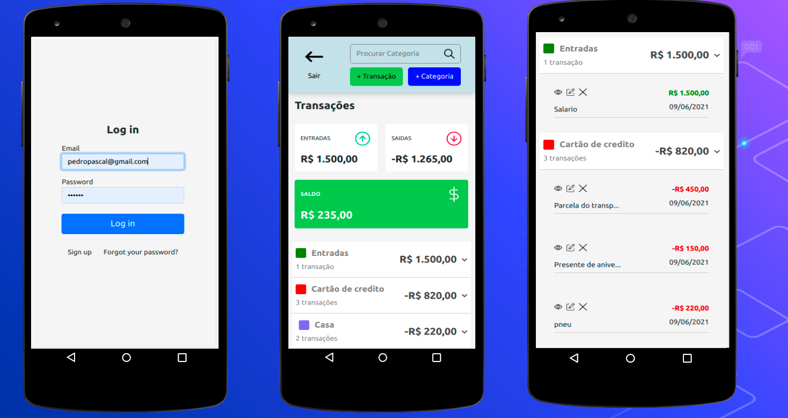

<div align='center'>
    
</div>
<p align='center'>Um sistema em formato mobile para organizar suas finanças</p>

## 🛠 Tecnologias | Dependências

<p>Principais ferramentas que foram usadas na construção do projeto</p>

<h3>Tecnologias</h3>

✔️ Ruby on rails <br>
✔️ sqlite3 em ambiente de desenvolvimento<br>
✔️ postgresql em ambiente de produção<br>

<h3>Dependências</h3>

✔️ ruby '2.7.0' <br>
✔️ ruby on rails  6.1.3 <br>


## <h4 align="center"> 
    🚀 Finances-key concluido  

## pré-requisito

Antes de começar, você vai precisar ter instalado em sua máquina as seguintes ferramentas: 

[Ruby](https://www.ruby-lang.org/pt/), [Ruby on rails](https://guides.rubyonrails.org/v5.0/getting_started.html) e [Yarn](https://classic.yarnpkg.com/en/docs/install/#windows-stable).

Além disso é bom ter um editor para executar o código como [VsCode](https://code.visualstudio.com/download)

### 🎲 Rodando o projeto

```bash

#clone este repositório

$ git clone https://github.com/LeandroSannt/Finances-key.git

## acesse a pasta do projeto no terminal/cmd

$ cd Finances-key

## instale as dependencias do projeto

$ bundle install

## instale as dependencias yarn

$ yarn install --check-files

## execute a aplicação em modo de desenvolvimento 

$ rails s

# Caso precise reiniciar dropar o projeto utilze

rails dev:setup 

```

<h3>Para testar o projeto em produção acess link</h3>

[Finances-key](https://afternoon-thicket-51227.herokuapp.com/users/sign_in)

Registre-se e aproveite 

## <h4 align="center"> 
   🚧  OBS: O Sistema foi feito para ser utilizado em visao mobile futuramente atualização para um wpa 🚧 


